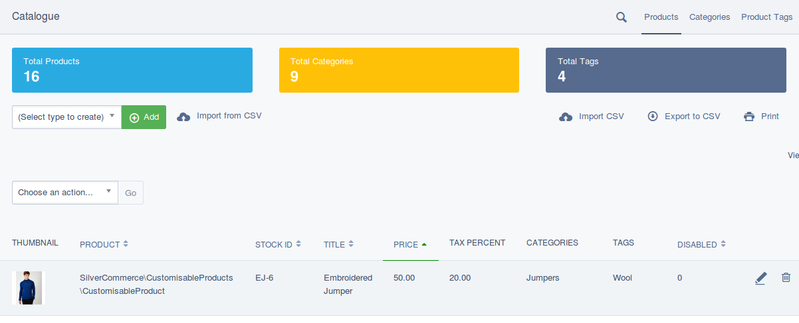

# Summary Info Snippets

You can add "Summary Info" to the top of your `ModelAdminPlus` views by utilising
`ModelAdminSnippets`. These snippets are simple objects that track a title and content,
but as they also extend `ViewableData` they can also be exanded with additional content
to suit your needs.



## Adding snippets

Adding snippets is pretty simple, you simply must create a new snippet class and then
register it with the relvent model admin interface. For example, if I have a custom
admin controller to view Products, Categories and Tags, I could create three summary
snippets (one for each):

```php
use ilateral\SilverStripe\ModelAdminPlus\ModelAdminSnippet;

class ProductSnippet extends ModelAdminSnippet
{
    private static $title = "Total Products";
 
    public function getContent()
    {
        return Product::get()->count();
    }
}

class CategorySnippet extends ModelAdminSnippet
{
    private static $title = "Total Categories";

    private static $background = self::WARNING;
 
    public function getContent()
    {
        return Category::get()->count();
    }
}

class TagsSnippet extends ModelAdminSnippet
{
    private static $title = "Total Tags";

    private static $background = self::SECONDARY;
 
    public function getContent()
    {
        return ProductTag::get()->count();
    }
}
```

Then you can register these snippets with the `ModelAdminPlus` controller in YML as follows:

```YML
SilverCommerce\CatalogueAdmin\Admin\CatalogueAdmin:
  registered_snippets:
    - ProductSnippet
    - CategorySnippet
    - TagsSnippet
```

You can also specify snippets for a specific managed model class by doing the following:

```YML
SilverCommerce\CatalogueAdmin\Admin\CatalogueAdmin:
  registered_snippets:
    - MyProductClass:
      - ProductSnippet
      - CategorySnippet
      - TagsSnippet
```


## Changing the background colour

By default, a snippet can be given a background that utilises a Bootstrap colour class
(for example "primary", "info", etc).

You can define this via the ss config variable:

    ilateral\SilverStripe\ModelAdminPlus\ModelAdminPlus.background

## Changing the text colour

A snippet can be given a font colour that utilises a Bootstrap colour class
(for example "primary", "info", etc).

You can define this via the ss config variable:

    ilateral\SilverStripe\ModelAdminPlus\ModelAdminPlus.text

## Changing the order of apperance

The order snippets are loaded is dictated by the `priority` config variable (higher numbers are
loaded first).

You can define this via the ss config variable:

    ilateral\SilverStripe\ModelAdminPlus\ModelAdminPlus.priority